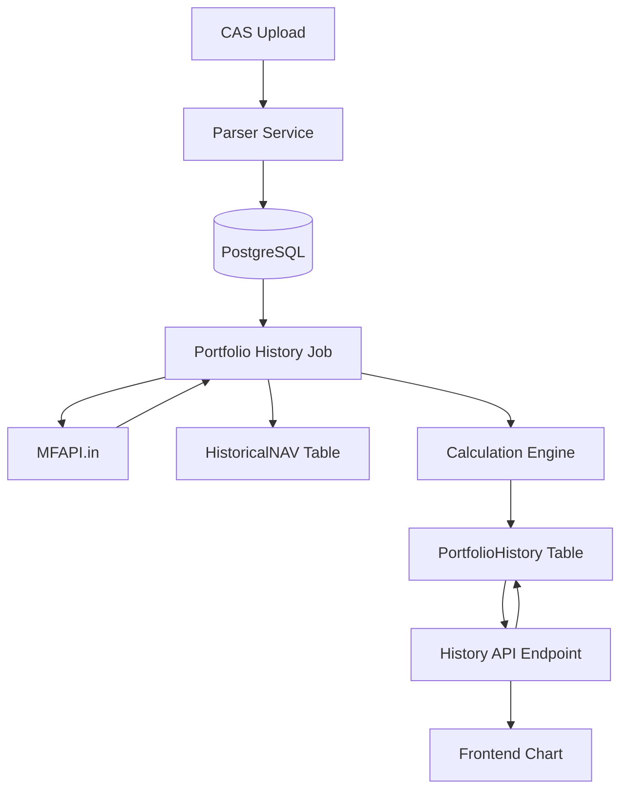

# Architecture: Portfolio History Engine

```mermaid
graph TD
    CAS[CAS Upload] --> Parser[Parser Service]
    Parser --> DB[(PostgreSQL)]
    DB --> Job[Portfolio History Job]
    Job --> MFAPI[MFAPI.in]
    MFAPI --> Job
    Job --> HistNAV[HistoricalNAV Table]
    Job --> Calc[Calculation Engine]
    Calc --> HistPort[PortfolioHistory Table]
    API[History API Endpoint] --> HistPort
    HistPort --> API
    API --> UI[Frontend Chart]
```
